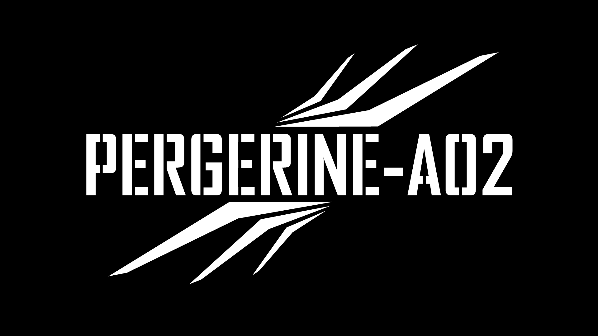

# PEREGRINE Drone Experiments

PEREGRINE is the Forgotten Industries drone field-system dossier.

This folder preserves the working material for Perry 1 / PEREGRINE-A01,
Perry 2 / PEREGRINE-A02, and the planned Perry 3 / PEREGRINE-A03 replacement.
The canonical archive records live in:

- `src/projects.yml`
- `src/inventory.yml`
- `src/field-logs.yml`

The project-local files here hold richer source notes, aircraft registry data,
templates, and repair context that should not be flattened into the main YAML
until it has been confirmed.

## Current Aircraft

- Perry 1 / PEREGRINE-A01: DJI Mini 4K crash/recovery bird.
- Perry 2 / PEREGRINE-A02: DJI Mini 3 with DJI RC.
- Perry 3 / PEREGRINE-A03: planned DJI Mini 3 replacement aircraft.

## Visual Assets

- `assets/projects/peregrine/peregrine-a02.png` - PEREGRINE-A02 white mark on black field, 1920x1080 PNG.

## Standing Rule

Ground damaged aircraft first. Document the physical state before calibration,
repair, or interpretation.

A thing documented is a thing not yet lost.
